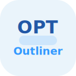

# OPT-Outliner

Logo: 

Aplicación PWA minimalista, mobile-first y modular para gestión personal, objetivos y tareas de tipo outliner, con soporte multilenguaje, base de datos local indexada, exportación/importación y sincronización con Google Drive.

---

## Arranque local

1. Instalar dependencias:
   ```bash
   cd opt-outliner
   bun install
   ```
2. Lanzar servidor de desarrollo:
   ```bash
   bun run dev
   ```
3. Abrir en navegador (ideal en móvil o tamaño reducido para preview mobile).

---

## Características iniciales (1ª versión)
- Mobile-first, diseño moderno, dark/light mode.
- DB local: modelos Dexie con export/import JSON y sync Google Drive (OAuth2).
- Árbol interactivo de nodos (outliner).
- Formularios dinámicos según estructura JSON.
- Agenda, calendario, filtros y outliners personalizados.
- Multilenguaje autodetectable vía carpeta `/i18n`.

> Logo e identidad de marca provisional, tonos azules, minimal.
